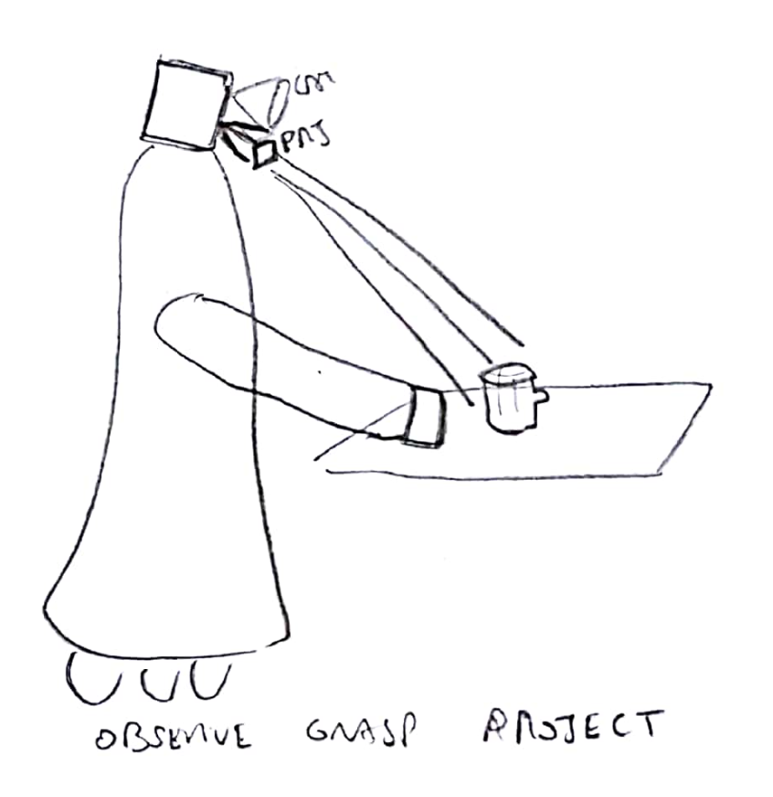
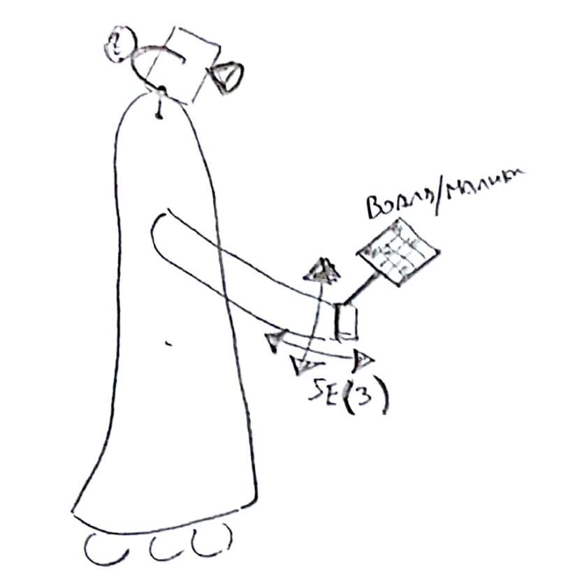
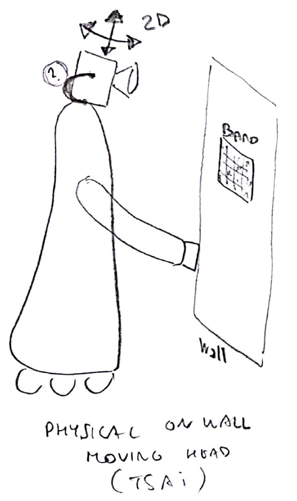
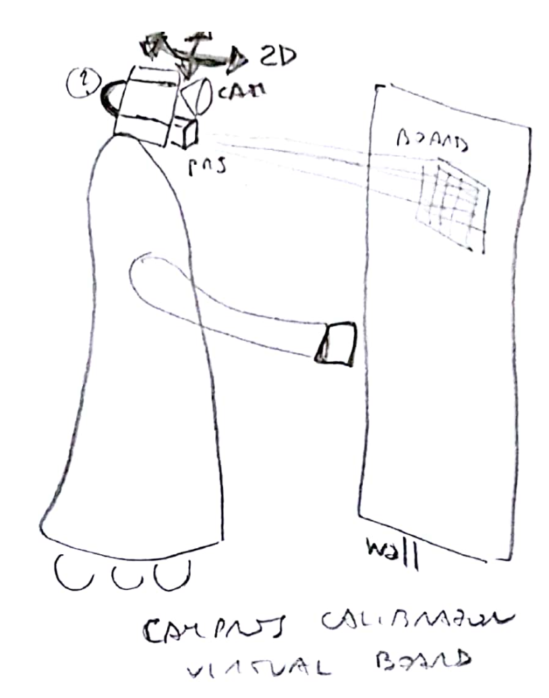

TODO: documentation for visual verification of results

# Camera-Robot Calibration Manual for RAMCIP


There are two main camera-robot calibration elements in the RAMCIP robot

1) Projector Intrinsics and Camera-Projector 
2) Camera-Body 

Calibration is provided via the external package: https://bitbucket.org/eruffaldi/ramcip_calib_sssa and it follows a common approach across the different types of calibration. The steps are the following:

1) Capture with tagging of relevant frames
2) Extraction of YAML files expressing the calibration problem
3) Computation and output of the results in usable form

These are the data flowing in the three steps

1) Capture produces a bag file
2) Extraction takes the bag file and produces YAML files in a folder
3) Computation takes YAML files and produces output as YAML file for calibration or a line for URDF
## Overall

| Name        | What           | Capture  | Calib | Bag | Output |
| ------------- | ------------- | -------------  | -------------  | -------------  | -------------  |
| K1Ar     | Camera-Projector and Projector Instrinsics | calib_k1ar_capture.launch | calib_k1ar_calib.launch | captureK1AR.bag | projector_ci.yaml projector_pose.urdf.xacro |
| K1Body    | Camera-Neck | calib_k1body_capture.launch | calib_k1body_calib.launch | captureK1Body.bag | kinect_pose.urdf.xacro |
| K1Hand*    | Camera-Hand | calib_k1hand_capture.launch | calib_k1hand_calib.launch | captureK1Hand.bag |

The final goal is shown in figure below in which we use object detected by the camera for grasping and projection:



First we have the Camera calibration using a marker on the body:



Alternatively if the body is not visible by the camera or there is enough motion it is possible to use the external board (Tsai):


      
The projector is calibrated using a projected board and the depth camera, differently from what is available in literature:



## Topics and Data

The following topics are used for the Kinect

* /kinect1/rgb/image/compressed
* /kinect1/rgb/camera_info
* /kinect1/depth/image/compressedDepth
* /kinect1/depth/camera_info
* /projector/camera_info

These are mapped to /camera, /camera_info

In addition we have:
* Trigger /trigger
* Plane /plane
* Board /boardk1
* Joints /joint_state
* TF


## Reference Frames

The following frames and their connections are used across the different calibrations

* Camera Frame: kinect1_rgb_optical_frame 
* Kinect Based: kinect1_link
* Platform Base: platform_base
* End-Effector of the Head: platform_head_pitch_link

# Trigger

Calibration is based on image snapshots when the moving parts are in a steady position. This is achievied automatically by the look around service by using a plateau in the motion centered at every pose. The result is a trigger message dispatched. This triggering message is used by the plane extractor for K1AR and by all the extraction phase in the calibrations. If the capture has been performed without trigger the only way is to inject trigger after the bag has been recorded.

For some calibrations such as K1Hand the trigger can be raised manually in two ways: (1) using RViz Interactive Markers, (2) interactive using 2D Image, (3) command line

## Interactive Markers
```
rosrun ramcip_calib_sssa interactive_trigger.py
```

Then from RViz when the interactive marker is moved the trigger is sent
## Interactive 2D 

Run this every time to insert a trigger. Use the image parameter to specify the message

```
rosrun ramcip_calib_sssa send_trigger.py _image:=/kinect1/rgb/image
```

## Command Line

Run this every time to insert a trigger

```
rosrun ramcip_calib_sssa send_trigger.py
```


# Alternate ROS Core

When step 2 is executed offline on a real robot it is necessary to create an Alternate ROS Core environment so that there is no interference with the main robot pub-sub system.

On Terminal A
```
altroscore
```

On Terminal B we launch the following before any Phase 2 command
```
export ROS_MASTER_URI=http://127.0.0.1:16666 
```

# K1AR: Camera-Projector

Produces:
1) Projector Intrinsics
2) Camera Projector Transformation: 

The Transformation is aimed at the xacro file at: $(find ramcip_description)/model/sensors.urdf.xacro replacing the line "projector parent".

The Intrinsics are produced generating $(find ramcip_calib)/data/projector_ci.yml

## Physical Setup

Robot in front of a white wall so that the motion of the head in the range specified is projected over the wall as a single flat surface. Eventually modify the focus lever.

## Software Setup

Requires: the robot controlle active

We start the camera
```
roslaunch ramcip_human_tracking ramcip_human_tracker.launch
```

On PC2 we start the head service
```
roslaunch ramcip_head_action look_around.launch
```

## Capture Start

Shell 1: On PC1 we start projection and recording
```
export DISPLAY=:0
xset s activate
roslaunch ramcip_calib_sssa calib_k1ar_capture.launch
```

Shell 2: On PC2 we start the motion of the head. The range of the head can be controlled modifying the file ramcip_head_action/launch/look_around.launch modifying the pan/tilt == yaw/pitch joint angles in radians.

```
rosrun ramcip_head_action look_around_client.py
```

The file look_around.launch specifies the number of interval. When the robot stops moving it is possible to stop Shell 1 and verify if the resulting file is correct:

```
rosbag info captureK1AR.bag | grep boardk1 
rosbag info captureK1AR.bag | grep trigger
```

## Extraction

Inside the ALT ROS environment:
```
roslaunch ramcip_calib_sssa calib_k1ar_calib.launch inputbag:=${PWD}/captureK1AR.bag with_inputbag:=true action:=save inputbag_rate:=2
find calibk1ar | grep yaml | wc -l
```

Then calibration:
```
roslaunch ramcip_calib_sssa calib_k1ar_calib.launch action:=calibload
```

# K1Body: Camera-Body

Computes the transformation between the K1 attachment and the neck end-effector using a Moving Head, Fixed Marker approach.

## Physical Setup

Robot in front of the wall where a Marker Board has been attached. Due to the Kinect resolution the board should be A4 with near robot or A3 with farther robot.

Board A4:  ramcip_calib_sssa/data/board_phyv2/boardA4.pdf (7cm)
Board A3:  ramcip_calib_sssa/data/board_phyv2/boardA3.pdf

Note: the board has to be printed without any change of scale so that we have 7cm markers

## Software Setup

Assuming the robot controlle ready

We start the camera
```
roslaunch ramcip_human_tracking ramcip_human_tracker.launch
```

On PC2 we start the head service
```
roslaunch ramcip_head_action look_around.launch
```

## Capture Start

Shell 1: On PC1 we start recording
```
roslaunch ramcip_calib_sssa calib_k1body_capture.launch
```

Shell 2: On PC2 we start the motion of the head. The range of the head can be controlled modifying the file ramcip_head_action/launch/look_around.launch modifying the pan/tilt == yaw/pitch joint angles in radians.

```
rosrun ramcip_head_action look_around_client.py
```

The file look_around.launch specifies the number of interval. When the robot stops moving it is possible to stop Shell 1 and verify if the resulting file is correct:

```
rosbag info captureK1Body.bag | grep boardk1 
rosbag info captureK1Body.bag | grep trigger
```

Improvement: move also the torso of the robot for extending the range

## Extraction

Inside the ALT ROS environment:
```
roslaunch ramcip_calib_sssa calib_k1body_calib.launch inputbag:=${PWD}/captureK1Body.bag with_inputbag:=true action:=save inputbag_rate:=2
find calibk1body | grep yaml | wc -l
```

Then calibration:
```
roslaunch ramcip_calib_sssa calib_k1body_calib.launch action:=calibload
```


# NOT YET K1Hand: Camera-Body using Marker in the Hand

Computes the transformation between the K1 attachment and the neck end-effector using a Fixed Hand, Marker in the Hand approach

## Physical Setup

Robot with Marker or Markerboard attached to the end-effector or to another joint so that it is possible to move it with the end-effector

Board A4:  ramcip_calib_sssa/data/board_phyv2/boardA4.pdf (7cm)

Note: the board has to be printed without any change of scale so that we have 7cm markers

## Software Setup

Assuming the robot controlle ready

We start the camera
```
roslaunch ramcip_human_tracking ramcip_human_tracker.launch
```

## Capture Start

Shell 1: On PC1 we start recording
```
roslaunch ramcip_calib_sssa calib_k1body_capture.launch
```

On PC2 we have to move the hand with the marker freely so that it is visible. Trigger has to be generate manually as discussed above.

Verification

```
rosbag info captureK1Hand.bag | grep boardk1 
rosbag info captureK1Hand.bag | grep trigger
```

Improvement: move also the torso of the robot for extending the range

## Extraction

Inside the ALT ROS environment:
```
roslaunch ramcip_calib_sssa calib_k1hand_calib.launch inputbag:=${PWD}/captureK1Hand.bag with_inputbag:=true action:=save inputbag_rate:=2
find calibk1body | grep yaml | wc -l
```

Then calibration:
```
roslaunch ramcip_calib_sssa calib_k1hand_calib.launch action:=calibload
```
# Calibration of Robot v1

## Camera-Projector

Resolution 1366x768

As of ramcip_calib/datar1/projector_ci.yaml only K because no distorsion
```
K = [[2283, 0.0, 700], [0.0, 2302, 765],  [0.0, 0.0, 1.0]]
```

Pose is in ramcip_description/model/projector_pose.urdf.xacro

```
      <projector parent="kinect1_rgb_optical_frame" name="projector">
         <origin xyz="-0.042255 0.051946 0.000814" rpy="0.213309 0.015789 0.010629"/>
      </projector>
```

## Kinect

```
<kinect parent="platform_head_pitch_link" name="kinect1">
          <origin xyz="0.17 0.032  0.153" rpy="0.01 0.70 0" />
      </kinect>
```

# Results 8 September 2017

## Camera-Projection Run 1

RMS: 3.7
Imagees Used: 30
Resolution 1366x768


As of ramcip_calib/datar1/projector_ci.yaml only K because no distorsion
```
K = [[1.99099565e+03,  0.00000000e+00,   7.09699165e+02],  [  0.00000000e+00,   2.00126594e+03,  7.26177548e+02],       [  0.00000000e+00,   0.00000000e+00,  1.00000000e+00]
```

Pose is in ramcip_description/model/projector_pose.urdf.xacro

RVec: 0.06747764, 0.01293018, 0.01144713
tvec: -0.03305286, 0.03478025, 0.00672303

TODO get spec below as URDF

```
      <projector parent="kinect1_rgb_optical_frame" name="projector">
         <origin xyz="-0.03305286101781551 0.03478024814480575 0.006723026488737838" rpy="0.0675537388457 0.0125339992604 0.0118751587943"/>
      </projector>
```


## Camera-Projection Run 2

Images:
Reprojection Error:
Projection K:
Camera-Projector Distance:

Result stored i folder datar2 of branch F#831_calibration_robot2
